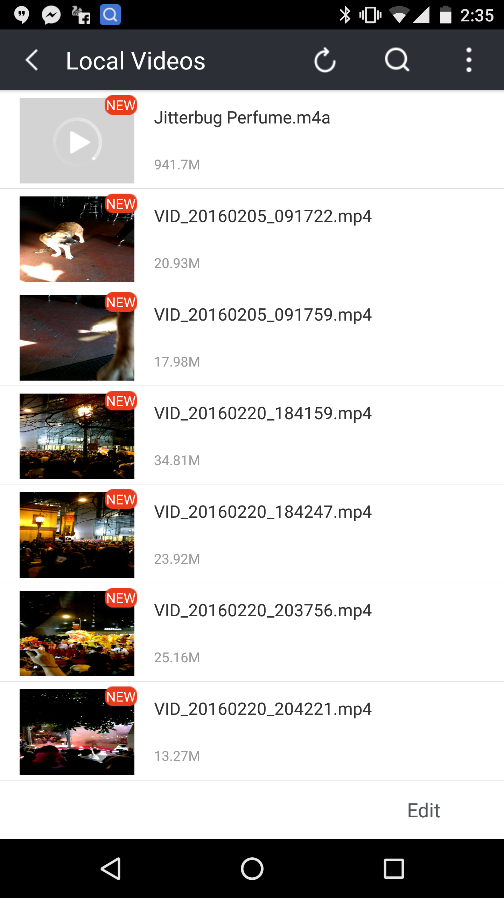

# Offline service worker contents
Allowing service workers to provide details about the content of their offline experiences.

See the [EXPLAINER](https://github.com/drufball/sw-content-indexing/blob/master/EXPLAINER.md) for proposed solutions.

## Problem
Users have no easy way of finding sites that have full offline experiences when they have no network connection. Many users don’t even have an expectation that offline web experiences exist at all.

The browser could help to promote and manage good offline experiences, but it is limited in the information it has. The browser can identify what URLs have been cached, but it has no way of knowing which URLs are important or what kind of content is available. A registered SW + its cache could be a fully interactive offline experience, an app shell, or a skeleton that only enables push notifications. 

## Use Cases
With more knowledge about the contents of service workers, browsers could take steps to promote offline sites and content. When offline, a browser could only autocomplete URLs that have meaningful content to show the user. Browsers could also offer an “Offline” page that lists URLs and content that the user can explore, similar to UC browser's offline video section:

    </img>

Transparent SW contents could be used with [foreign fetch](https://github.com/mkruisselbrink/ServiceWorker/blob/foreign-fetch/foreign_fetch_explainer.md) to create entire ecosystems of offline experiences between collaborating sites.
